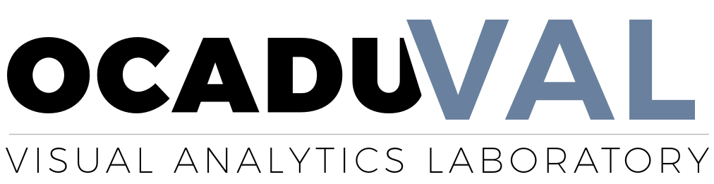

## Geo Presentation tool

This project began as a different thing. The original intent was to map data from various sources (opendata toronto) for the benefeit of the OCADU Visual Analytics Lab

This project is now intended to be a presentation tool. It will be a two-part app. The two parts work together as a presentation format intended for meetings or information discoveries.

### Mapping Controller

Mapping Controller is the large map that a presenter would use. This tool will have a few elements. The first is a large GEOJSON represntation of a map. The second is a QR Code that represents the instantiated session for the meeting to take place in. The third is a communication (publish/subscribe model) between the controller and the dashboard.

As of V.1.0 the map represents districs in toroto. Selecting a district will apply a filter to the data that the dashboard uses. As a visual queue that something changed, the selected area will appear red.

Selecting an area sends an object (from the geoJSON) through the pubnub service to the dashboard app. This object sending will trigger a change in the dashboard.

This tool has 2 states:

**State 1: Prepare Audience**

This state displays a large QR code which holds the name of the current session, for the benefit of the dashboard users. When all users are logged in, the presenter can click a button to go to state 2.

**State 2: Navigate Map**

This state displays the map and allows interaction with the map. If the presenter wants to, they can click a button to go back to state 1.

### Mapping Dashboard

The Mapping Dashboard is a drill-down of data. The data will be filtered or delivered by the Mapping Controller's actions. The app does not work unless it has been signed in, so it must have some stages or states.

**State 1: Prepare Login.**

This state is simple. There is a logo, and a button that says "begin Log in". Clicking this button ends this state and begins the second state.

Right now there are no other features in state 1.

**State 2: Login**

This state will have a library that reads QR Codes. It access the hardware's camera. The user needs to direct the camera at a QR code, which will send a message to the controller with the session name and the command to log in to the session.

This state ends with a fade out.

**State 3: Dashboard**

This state will contain all interactions belonging to the dashboard. Any interactions or changes to the view will exist within this state. If the user exits this state, or restarts the app, the user will have to begin at state 1 again.

Version Notes.

**v.1.0**

Migrate app from previous model to current model. 
